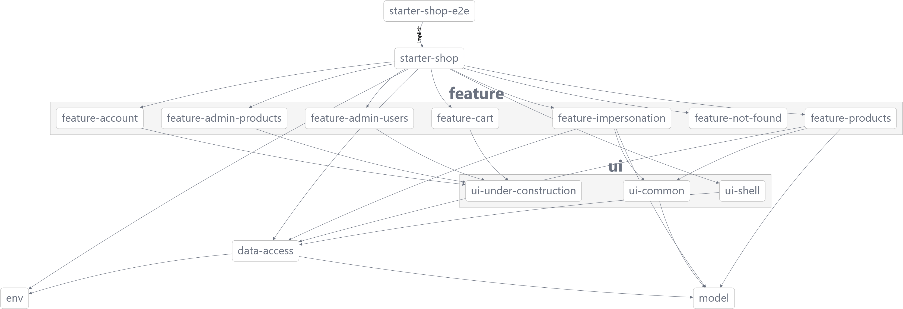

# Starter Shop

A place where anyone can impersonate any other one. Please see the task [here](README-task.md).

*This project was bootstrapped with [Nx](https://nx.dev).*

## Install

```shell
npm ci
```

## Run

1. Start the backend emulator:

```shell
npm run backend:start
```

2. Run the app in a separate console window:

```shell
npm start
```

3. Visit [http://localhost:4200](http://localhost:4200) in a browser.

## Lint

```shell
npm run lint
```

## Test

### Unit

```shell
npm test
```

### Integration

```shell
npm run e2e
```

## Structure

- `apps/starter-shop` - the main entry point for the app.
- `apps/starter-shop-e2e` - integration tests.
- `libs/feature/*` - feature libs, usually lazy loaded screens.
- `libs/env` - typed environment injectable object, to be defined inside the app.
- `libs/ui/*` - UI libraries.
- `libs/model` - models.
- `libs/data-access` - backend API connectors + state

## Dependency graph

```shell
npm run graph
```


